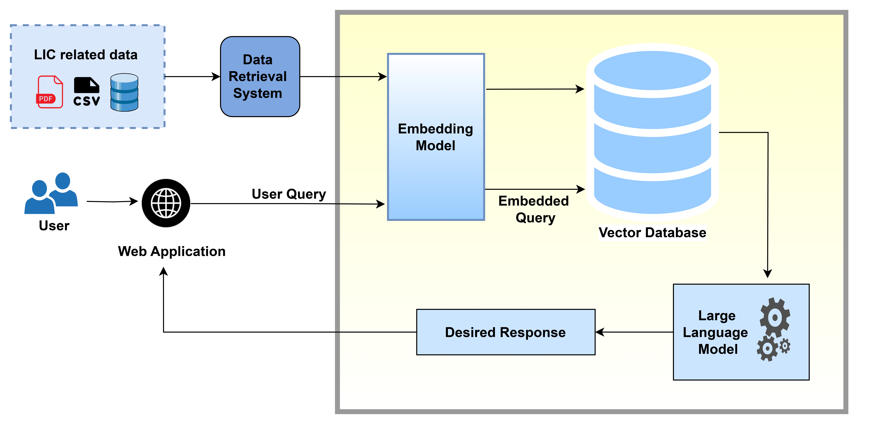
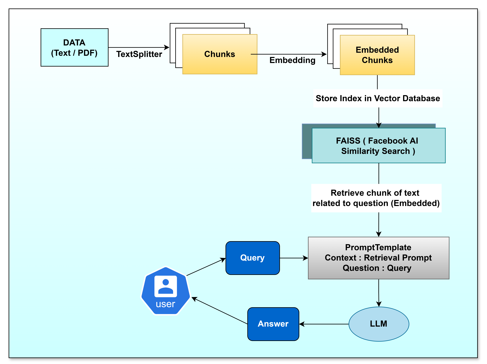

# 🤖 INSUREIQ -A RAG Based Multilingual Assistance For LIC Services


A smart, multilingual LIC insurance advisor chatbot that uses Retrieval-Augmented Generation (RAG) to answer queries from LIC policy documents with high accuracy, grounded responses, and human-like explanations.

---

## 🔍 Overview

This project implements a conversational chatbot for **Life Insurance Corporation (LIC)** using:

- 📄 LIC policy PDFs and structured datasets  
- 🧠 Google Generative AI (`gemini-1.5-flash`)  
- 📚 FAISS vector store for fast document retrieval  
- 🦜 LangChain for the RAG pipeline  
- 🎨 Streamlit frontend for chat interaction  

It allows users to ask questions like _“What is the grace period for Jeevan Amar?”_ and get answers extracted from LIC’s official documents in seconds.

---

## 🧠 How It Works

1. **Data Ingestion**  
   LIC policy PDFs and other documents are loaded and split into manageable chunks.

2. **Embedding Generation**  
   Each chunk is converted into a dense vector using Google’s Generative AI Embedding model (`embedding-001`).

3. **Vector Indexing**  
   All embeddings are stored using **FAISS** for semantic similarity search.

4. **RAG Pipeline**  
   When a user enters a query, it is embedded and matched with relevant chunks. The matched chunks + query are passed to the LLM (Gemini) to generate a final response.

5. **User Interface**  
   The result is shown to the user in a Streamlit-powered chat UI with LIC branding and sources cited.

---
## 🧭 System Architecture



---

## 🔁 Chatbot Process Flow



---

## 🛠️ Tech Stack

| Component        | Tool/Library                      |
|------------------|-----------------------------------|
| Language         | Python 3.10+                      |
| UI Framework     | Streamlit                         |
| Vector Store     | FAISS                             |
| Embedding Model  | Google Generative AI Embeddings   |
| LLM              | Gemini 1.5 Flash                  |
| Retrieval Logic  | LangChain (RAG + Prompt Templates)|
| Doc Parsing      | PyMuPDF, pdfminer.six             |

---

## 📁 Directory Structure

```
LIC-Chatbot/
├── app.py                   # Streamlit frontend
├── chatbot2.py              # RAG logic
├── create_embedding.py      # Builds vector index
├── scripts/
│   └── load_data.py         # Loads and chunks documents
├── vector_store/            # FAISS vector DB
├── data/                    # LIC PDFs and CSVs
├── .env                     # API key file
├── requirements.txt         # Dependencies
└── README.md                # This file
```
---

## ⚙️ Setup Instructions


1. **Clone the Repository**

    ```git clone https://github.com/your-username/lic-rag-chatbot.git ```

    ```cd lic-rag-chatbot```


2. **Create and Activate a Virtual Environment (Optional but Recommended)**

    ```python -m venv venv ```

   For Linux/macOS:
    ```source venv/bin/activate```

   For Windows:
    ```venv\Scripts\activate```


3. **Install Required Dependencies**

    ```pip install -r requirements.txt```


   If requirements.txt is missing, install manually:
    ```pip install streamlit langchain langchain-google-genai google-generativeai faiss-cpu python-dotenv PyMuPDF pandas```


4. **Configure Your Google Generative AI API Key**

   Create a .env file in the root directory and add:
    ```GOOGLE_API_KEY=your_google_gen_ai_api_key_here```


5. **Run the Chatbot (Frontend)**

    ```streamlit run app.py```


---
💬 Sample Queries
“What are the maturity benefits of Jeevan Labh?”

“Main 28 saal ka hoon, kaunsi policy suitable hai?”

“What is the grace period in LIC term plans?”

